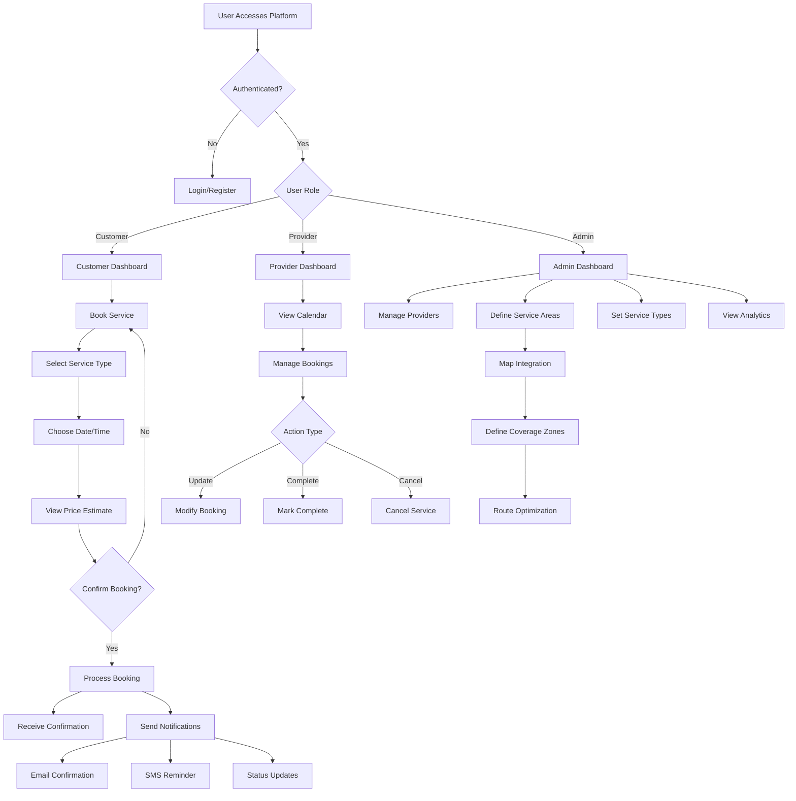

# User Flow Implementation

This document explains how the user flow from the provided Mermaid diagram has been implemented in the application.

## Overview

The application implements a role-based authentication system with different user interfaces and flows for Customers, Providers, and Admins. The user flow follows the diagram:

## Implementation Components

### 1. Role-based Authentication System

We've implemented a comprehensive authentication system that:

- Supports different user roles (customer, provider, admin)
- Automatically assigns roles during signup
- Uses Supabase Auth with Row Level Security
- Provides dedicated signup flows for customers and providers

Key files:

- `handle_new_user()` function in the database
- `auth-helpers.js` with role-specific signup functions
- Auth screens: LoginScreen, RegisterScreen, ProviderSignupScreen

### 2. Navigation Flow

The navigation system routes users to different UIs based on their role:

- **RoleBasedNavigation.jsx**: Main navigation component that:
  - Checks authentication state
  - Retrieves user profile and role
  - Routes to the appropriate navigator based on role (Customer, Provider, or Admin)

### 3. Customer Flow

Supports the complete customer journey:

- Customer Dashboard
- Service booking flow:
  1. Book Service
  2. Select Service Type
  3. Choose Date/Time
  4. View Price Estimate
  5. Confirm Booking
  6. Receive Confirmation

### 4. Provider Flow

Supports the provider workflow:

- Provider Dashboard
- Calendar View
- Booking Management (Accept, Update, Complete, Cancel)
- Accessing assigned bookings through RLS

### 5. Admin Flow

Supports administrative functions:

- Managing providers
- Defining service areas
- Setting service types
- Viewing analytics

### 6. Database Structure

The database supports this flow with:

- Core tables for user profiles and roles
- Service-related tables (categories, areas, services)
- Booking-related tables (bookings, payments, reviews)
- RLS policies to enforce access control

## How to Test

1. **Register a Customer**:

   - Use the Register screen to create a customer account
   - After email confirmation, access the customer dashboard
   - Follow the booking flow

2. **Register a Provider**:

   - Use the Provider Signup screen to create a provider account
   - After email confirmation, access the provider dashboard
   - View and manage assigned bookings

3. **Admin Access**:
   - Admin accounts need to be manually created in the database
   - Set role to 'admin' in the profiles table
   - Create a corresponding entry in admin_profiles

## Remote Database Setup

To deploy these changes to your remote Supabase database:

1. Follow the steps in REMOTE_DB_SETUP.md to connect to your remote project
2. Push migrations using `supabase db push`
3. Verify database structure and RLS policies

## Next Steps

- Implement notifications system (email, SMS, in-app)
- Add service area management with map integration
- Create analytics dashboards for admin users
